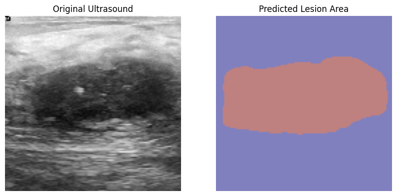

# Attention-Guided U-Net for Breast Ultrasound Segmentation

##  Project Overview
This repository focuses on enhancing the segmentation precision of breast ultrasound lesions. As a clinical medicine student, I optimized a standard **Attention U-Net** backbone to handle the high noise and ambiguous boundaries typical of ultrasound imaging. My work bridges the gap between raw AI performance and clinical requirements by focusing on model stability and interpretability.

##  Dataset
The model was developed and evaluated using the publicly available **BUSI (Breast Ultrasound Images Dataset)**.
*   **Source**: [Kaggle - Breast Ultrasound Images Dataset](https://www.kaggle.com/datasets/aryashah2k/breast-ultrasound-images-dataset)
*   **Scope**: Includes ultrasound images categorized into benign, malignant, and normal cases with expert-verified masks.

##  Key Improvements & Optimizations
While the architecture utilizes Attention Gates, I implemented specific tunings to reach a **0.80 Mean Dice score**:
*   **Loss Function Engineering**: Replaced standard Cross-Entropy with a composite **BCE-Dice Loss** to mitigate class imbalance between small lesions and large backgrounds.
*   **Training Strategy**: Integrated `EarlyStopping` and `ReduceLROnPlateau` to prevent overfitting on the limited medical dataset and ensure fine-grained convergence.
*   **Inference Deployment**: Developed a robust `predict.py` script with CPU fallback, ensuring the model can run in diverse clinical computing environments.

##  Visual Results
The optimized model effectively suppresses background noise and focuses on the lesion ROI (Region of Interest).

 

##  Repository Structure
*   `predict.py`: The main inference script for generating predictions on new ultrasound images.
*   `notebooks/`: Contains the original experimental notebook (`.ipynb`) documenting the training, tuning, and evaluation process.
*   `requirements.txt`: List of dependencies required to replicate the environment.

##  Quick Start (Inference)
To test the model on your own images:

1. **Clone the repo**:
    git clone [https://github.com/XiaoyangChenHMU/Attention-Guided-UNet-Breast-Ultrasound.git](https://github.com/XiaoyangChenHMU/Attention-Guided-UNet-Breast-Ultrasound.git)
3. **Install dependencies**:
pip install -r requirements.txt
4. **Run prediction**:
python predict.py
##  Acknowledgements
The baseline Attention U-Net architecture is adapted from existing research. My contribution primarily resides in the systematic optimization of the training pipeline and the development of the inference framework tailored for medical imaging tasks.
